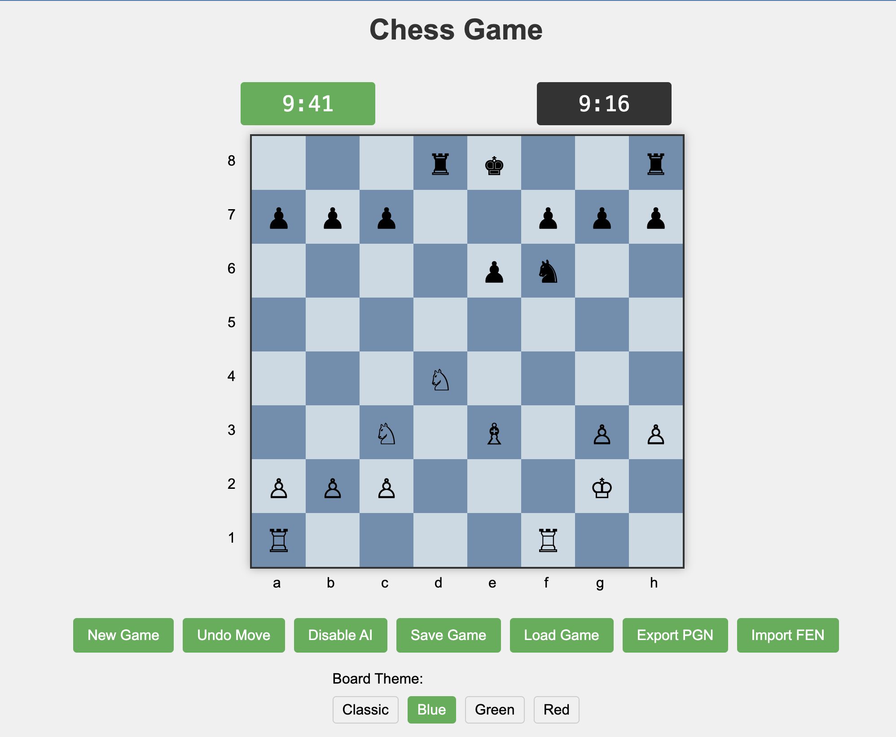

# Web Chess Game

A fully-featured chess implementation built with HTML, CSS, and vanilla JavaScript.

## Features

### Core Gameplay
- **Complete Chess Rules**: All standard chess piece movements and rules implemented
- **Special Moves**: Support for castling, en passant, and pawn promotion
- **Check & Checkmate Detection**: Automatic detection of check, checkmate, and stalemate conditions
- **Move Validation**: Only legal moves are allowed

### User Interface
- **Responsive Design**: Clean interface with board, controls and game information
- **Visual Indicators**: Highlights for selected pieces, valid moves, captures, and check
- **Coordinates**: Algebraic notation coordinates (a-h, 1-8)
- **Chess Clocks**: Timer functionality for timed games (10 minutes default)
- **Move History**: Records moves in standard algebraic notation

### Customization
- **Board Themes**: Modify the `themes` object to create new color schemes
- **AI Strength**: Adjust the evaluation function to change AI behavior

## Installation

No installation required! This is a standalone web application that runs entirely in the browser.

1. Download all files
2. Open `index.html` in any modern web browser
3. Start playing!

## Browser Compatibility

The game works in all modern browsers including:
- Chrome
- Firefox
- Safari
- Edge

## Future Enhancements

Potential improvements that could be added:
- Stronger AI with deeper evaluation
- Network play capability
- Opening book integration
- Game analysis tools
- Sound effects
- Drag and drop piece movement
- Mobile-optimized interface

## License

This project is available as open source under the terms of the MIT License.

## Contributing

Contributions to improve the game are welcome! Feel free to fork the repository and submit pull requests.

## Acknowledgments

- Chess piece Unicode symbols for the visual representation
- Classic chess board color schemes for the themes
d Themes**: Multiple color themes (Classic, Blue, Green, Red)
- **Game Controls**: Reset, undo, AI play, save/load

### Advanced Features
- **Simple AI Opponent**: Computer player with basic evaluation
- **Notation Support**:
  - FEN (Forsyth–Edwards Notation) import/export
  - PGN (Portable Game Notation) export
- **Save/Load**: Local storage for saving and resuming games

## How to Play

1. **Start a Game**: Open the HTML file in any modern browser to begin
2. **Moving Pieces**:
   - Click a piece to select it
   - Valid moves will be highlighted
   - Click on a highlighted square to make the move
3. **Special Controls**:
   - **New Game**: Reset the board to starting position
   - **Undo Move**: Take back the last move
   - **AI Move**: Have the computer make a move (or enable AI opponent)
   - **Save/Load Game**: Store the current game state in browser storage
   - **Export PGN**: Copy the game in PGN format to clipboard
   - **Import FEN**: Set up a specific board position

## Pawn Promotion
When a pawn reaches the opposite end of the board, a promotion dialog will appear, allowing you to choose between:
- Queen
- Rook
- Bishop
- Knight

## Technical Details

The game is implemented entirely in vanilla JavaScript without external dependencies. Notable implementation features include:

- **Chess Logic**: Complete ruleset with special move validation
- **Game State Management**: Tracks position data and game history
- **Board Representation**: 2D array of piece objects
- **Move Generation**: Efficient move calculation for all piece types
- **Check Detection**: Validates moves against illegal check situations
- **AI Logic**: Simple evaluation based on material, position, and development
- **Notation Parsers**: FEN import/export and PGN generation

## Customization

You can modify the following aspects of the game:

- **Time Controls**: Edit the `clockTime` variables to change default times
- **Boar